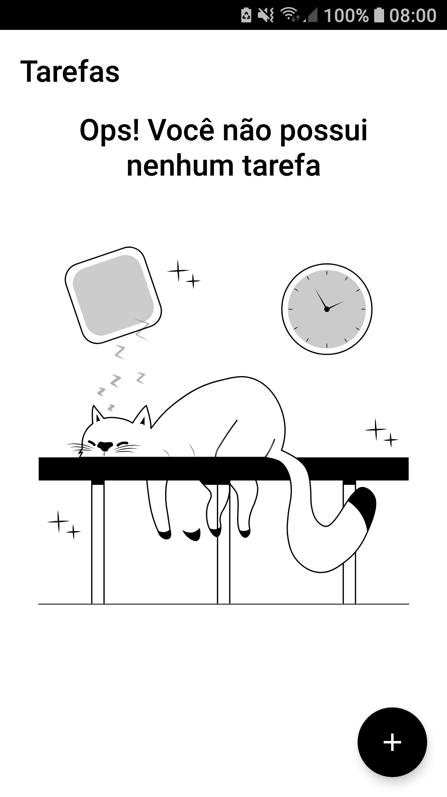
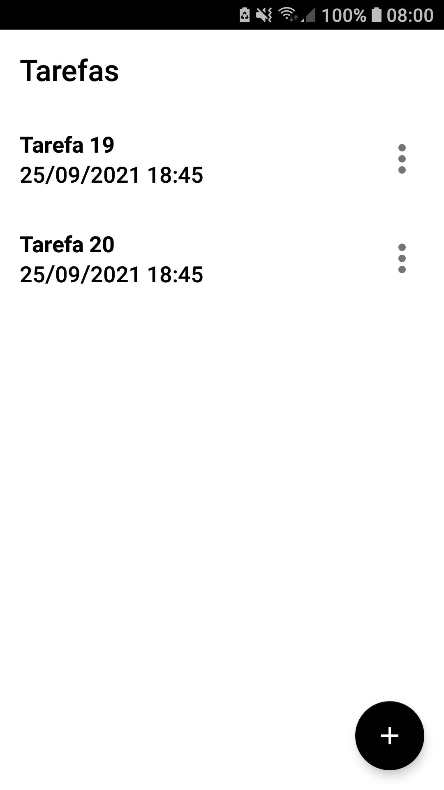
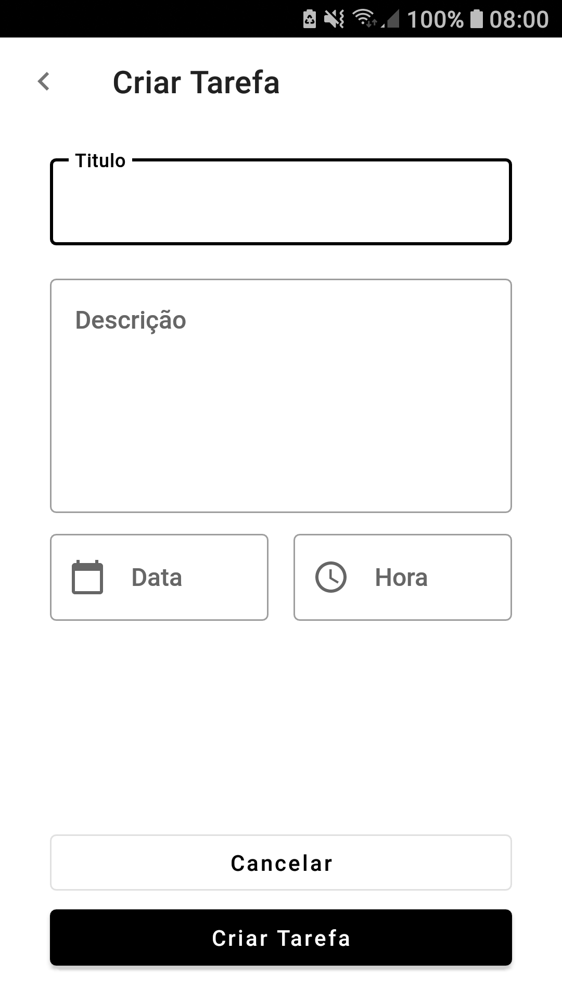
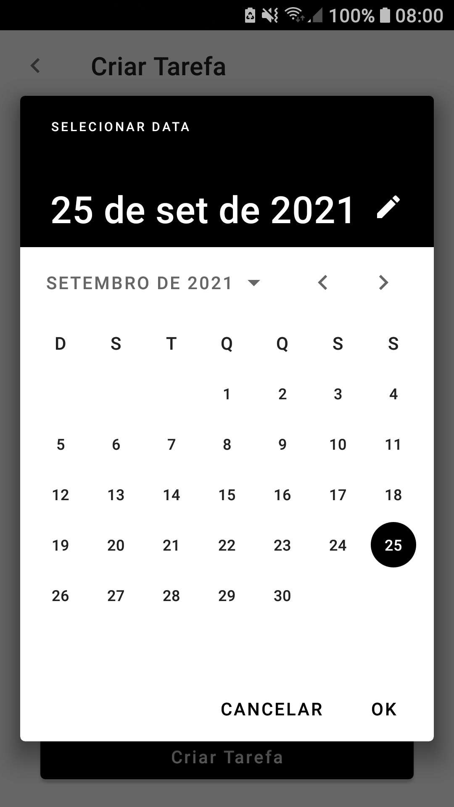
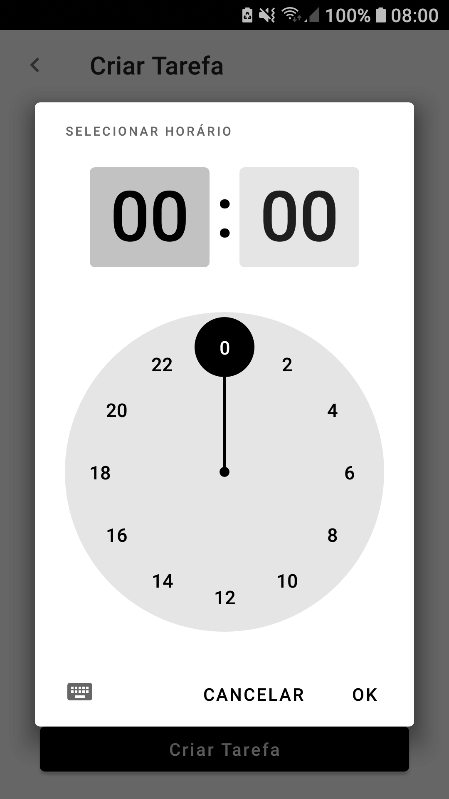

# DIO Bootcamp Kotlin
> O objetivo do projeto é colocar em prática alguns dos conceitos apresentado durante o Bootcamp da Digital Innovation One, utlizando a linguagem de programação(Kotlin) e padrões de desenvolvimento do Google.   
> **Obs:** O projeto possuí duas Branches, a `main`, na qual tem o projeto seguido durante o Bootcamp, e a `todo-room-mvvm`, que possui a resolução do desafio proposto, utilizando **Room** e **MVVM**.

## Projeto

  
  
  
  
  

